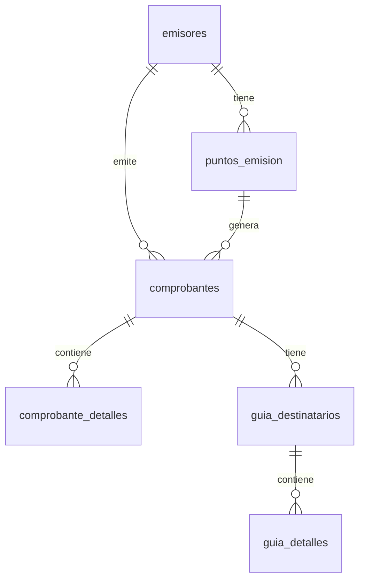

# Base de Datos

Esquema de la base de datos PostgreSQL (Supabase) para el sistema de facturación electrónica.

---

## Tablas Principales

### `emisores`

Almacena información de los contribuyentes emisores.

| Columna                  | Tipo        | Descripción                 |
| ------------------------ | ----------- | --------------------------- |
| `id`                     | UUID        | Identificador único         |
| `ruc`                    | VARCHAR(13) | RUC del emisor              |
| `razon_social`           | VARCHAR     | Razón social                |
| `nombre_comercial`       | VARCHAR     | Nombre comercial            |
| `direccion_matriz`       | TEXT        | Dirección matriz            |
| `obligado_contabilidad`  | BOOLEAN     | Obligado a contabilidad     |
| `contribuyente_especial` | VARCHAR     | Nro. contribuyente especial |
| `activo`                 | BOOLEAN     | Estado activo               |

---

### `puntos_emision`

Puntos de emisión por establecimiento.

| Columna           | Tipo       | Descripción            |
| ----------------- | ---------- | ---------------------- |
| `id`              | UUID       | Identificador único    |
| `emisor_id`       | UUID       | FK a emisores          |
| `establecimiento` | VARCHAR(3) | Código establecimiento |
| `punto_emision`   | VARCHAR(3) | Código punto emisión   |
| `direccion`       | TEXT       | Dirección del local    |
| `activo`          | BOOLEAN    | Estado activo          |

---

### `comprobantes`

Tabla principal de comprobantes electrónicos.

| Columna               | Tipo        | Descripción                      |
| --------------------- | ----------- | -------------------------------- |
| `id`                  | UUID        | Identificador único              |
| `emisor_id`           | UUID        | FK a emisores                    |
| `punto_emision_id`    | UUID        | FK a puntos_emision              |
| `tipo_comprobante`    | VARCHAR(2)  | Código tipo (01, 04, 05, 06, 07) |
| `ambiente`            | VARCHAR(1)  | 1=Pruebas, 2=Producción          |
| `secuencial`          | VARCHAR(9)  | Número secuencial                |
| `clave_acceso`        | VARCHAR(49) | Clave de acceso única            |
| `fecha_emision`       | DATE        | Fecha de emisión                 |
| `estado`              | VARCHAR     | Estado del comprobante           |
| `fecha_autorizacion`  | TIMESTAMPTZ | Fecha de autorización SRI        |
| `numero_autorizacion` | VARCHAR     | Número autorización SRI          |

#### Campos del Receptor

| `receptor_tipo_identificacion` | VARCHAR(2) | Tipo ID |
| `receptor_identificacion` | VARCHAR | Número ID |
| `receptor_razon_social` | VARCHAR | Razón social |
| `receptor_email` | VARCHAR | Email |

#### Campos para Notas de Crédito/Débito

| `doc_modificado_tipo` | VARCHAR(2) | Tipo doc. modificado |
| `doc_modificado_numero` | VARCHAR | Número doc. modificado |
| `doc_modificado_fecha` | DATE | Fecha doc. modificado |
| `motivo` | TEXT | Motivo de la nota |

#### Campos para Guía de Remisión

| `dir_partida` | TEXT | Dirección de partida |
| `placa` | VARCHAR | Placa del vehículo |
| `ruc_transportista` | VARCHAR | RUC transportista |
| `razon_social_transportista` | VARCHAR | Nombre transportista |
| `fecha_ini_transporte` | DATE | Fecha inicio |
| `fecha_fin_transporte` | DATE | Fecha fin |

---

### `comprobante_detalles`

Detalle de productos/servicios.

| Columna            | Tipo    | Descripción            |
| ------------------ | ------- | ---------------------- |
| `id`               | UUID    | Identificador único    |
| `comprobante_id`   | UUID    | FK a comprobantes      |
| `codigo_principal` | VARCHAR | Código del producto    |
| `descripcion`      | TEXT    | Descripción            |
| `cantidad`         | DECIMAL | Cantidad               |
| `precio_unitario`  | DECIMAL | Precio unitario        |
| `descuento`        | DECIMAL | Descuento              |
| `subtotal`         | DECIMAL | Subtotal sin impuestos |

---

### `guia_destinatarios`

Destinatarios de guías de remisión.

| Columna                            | Tipo       | Descripción         |
| ---------------------------------- | ---------- | ------------------- |
| `id`                               | UUID       | Identificador único |
| `comprobante_id`                   | UUID       | FK a comprobantes   |
| `tipo_identificacion_destinatario` | VARCHAR(2) | Tipo ID             |
| `identificacion_destinatario`      | VARCHAR    | Número ID           |
| `razon_social_destinatario`        | VARCHAR    | Razón social        |
| `dir_destinatario`                 | TEXT       | Dirección destino   |
| `email_destinatario`               | VARCHAR    | Email               |
| `motivo_traslado`                  | VARCHAR    | Motivo              |

---

### `guia_detalles`

Detalle de productos en guía de remisión.

| Columna           | Tipo    | Descripción             |
| ----------------- | ------- | ----------------------- |
| `id`              | UUID    | Identificador único     |
| `destinatario_id` | UUID    | FK a guia_destinatarios |
| `codigo_interno`  | VARCHAR | Código producto         |
| `descripcion`     | TEXT    | Descripción             |
| `cantidad`        | DECIMAL | Cantidad                |

---

## Diagrama ER

