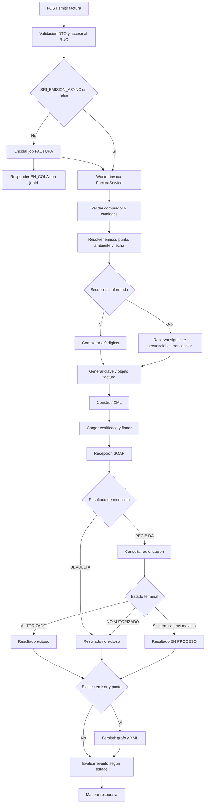

# 07 - Flujos de proceso AS-IS

## Alcance del lote 2

Este documento describe el flujo comun de emision SRI y su implementacion para factura. El analisis es estatico: no se ejecutaron la aplicacion, BullMQ, PostgreSQL, filesystem ni servicios SOAP. Los flujos de notas de credito/debito, retencion y guia quedan fuera de este lote aunque compartan componentes.

## Inventario

| ID | Flujo | Trigger | Resultado observado | PFV relacionados |
|---|---|---|---|---|
| DF-001 | Despacho de factura | `POST /sri/emitir/factura` | Ejecucion directa o job `FACTURA` en `sri-emision` | PFV-005, PFV-007, PFV-031, PFV-036, PFV-038 |
| DF-002 | Preparacion y validacion | Inicio de `FacturaService.emitirFactura` | DTO validado, emisor/punto resueltos y parametros de emision definidos | PFV-019, PFV-020, PFV-021, PFV-022, PFV-036, PFV-037 |
| DF-003 | Secuencial y clave | Preparacion completada | Secuencial normalizado/reservado y clave de 49 digitos | PFV-020, PFV-023, PFV-032, PFV-033 |
| DF-004 | XML y firma | Clave construida | XML de factura firmado con el P12 del emisor | PFV-022, PFV-029, PFV-036 |
| DF-005 | Recepcion y autorizacion SRI | XML firmado | `DEVUELTA`, `AUTORIZADO`, `NO AUTORIZADO`, `EN PROCESO` o excepcion | PFV-010, PFV-025, PFV-034 |
| DF-006 | Persistencia de resultado | Resultado SRI no excepcional con emisor y punto | Grafo de filas en transaccion DB y archivos XML sin rollback compartido | PFV-023, PFV-024, PFV-035 |
| DF-007 | Excepcion SOAP | Excepcion agotando recepcion o durante autorizacion | Intento de persistencia `PENDIENTE` y propagacion del error | PFV-006, PFV-032, PFV-034, PFV-035 |
| DF-008 | Eventos y respuesta | Fase condicional de persistencia completada u omitida | Evento autorizado/rechazado cuando aplica y DTO de respuesta | PFV-004, PFV-023, PFV-025, PFV-035 |
| DF-009 | Preview XML | `POST /sri/preview/factura` | XML sin firma, envio ni persistencia | PFV-020, PFV-022 |
| DF-010 | Debug firmado | `POST /sri/debug/factura-firmada` | Clave, XML sin firma y XML firmado, sin envio ni persistencia | PFV-029 |

## Flujo principal

**Evidence**
- File: `src/modules/sri/sri.controller.ts`; `src/modules/sri/sri.service.ts`; `src/modules/sri/processors/sri-emision.processor.ts`; `src/modules/sri/services/factura.service.ts`; `src/modules/sri/services/sri-soap.client.ts`
- Function / Method / Procedure: `SriController.emitirFactura`; `SriService.emitirFactura`; `SriEmisionProcessor.process`; `FacturaService.emitirFactura`; `SriSoapClient.enviarYAutorizar`
- Line / Section: controller 84-110; SriService 56-67; processor 24-46; factura 42-235; SOAP 84-213
- Condition / Query / Statement: la cadena confirmada decide cola/ejecucion directa, prepara el comprobante, firma, consulta SRI, persiste solo cuando hay emisor/punto y produce eventos/respuesta.
- Confidence: High

## DF-001 - Despacho HTTP y BullMQ

El controller exige JWT, aplica la guarda por RUC y un throttle especifico de diez solicitudes por minuto. La guarda busca el emisor solo por RUC y permite una fila con tenant nulo a usuarios que si tienen `tenantId`; su alcance queda en `PFV-036`. `SriService` ejecuta directamente solo cuando `SRI_EMISION_ASYNC` es exactamente `false`; cualquier otro valor encola el DTO completo y devuelve `jobId`/`EN_COLA`. El worker selecciona `FacturaService` por el tipo `FACTURA` y relanza sus errores.

**Evidence**
- File: `src/modules/sri/sri.controller.ts`; `src/modules/emisores/emisores.service.ts`; `src/modules/sri/sri.service.ts`; `src/modules/sri/processors/sri-emision.processor.ts`
- Function / Method / Procedure: `emitirFactura`; `validateRucAccess`; `process`
- Line / Section: controller 84-110; emisores 227-251; SriService 56-67; processor 24-46
- Condition / Query / Statement: la validacion de acceso precede al despacho; la comparacion literal de configuracion determina el modo y el processor vuelve a invocar el flujo completo.
- Confidence: High

La cola `sri-emision` se registra con opciones globales y vuelve a registrarse sin opciones dentro de `SriModule`. Por ello este documento no confirma que los intentos/backoff globales sean los efectivos para DF-001; se conserva `PFV-031`.

**Evidence**
- File: `src/common/queues/queue.module.ts`; `src/modules/sri/sri.module.ts`
- Function / Method / Procedure: registros BullMQ de `sri-emision`
- Line / Section: QueueModule 29-49; SriModule 27-32
- Condition / Query / Statement: el mismo nombre de cola tiene dos registros con conjuntos de opciones distintos; no se realizo verificacion runtime de resolucion DI.
- Confidence: Medium

El job conserva el DTO completo de Factura en Redis y las opciones globales
declaran retencion por conteo de jobs completados y fallidos. El acceso y la
retencion operativa de esos datos permanecen en `PFV-038`.

**Evidence**
- File: `src/modules/sri/sri.service.ts`; `src/common/queues/queue.module.ts`; `src/config/configuration.ts`; `docker-compose.prod.yml`
- Function / Method / Procedure: `SriService.emitirFactura`; registro de `sri-emision`; configuracion de colas; servicio Redis
- Line / Section: SriService 56-67; QueueModule 29-49; configuracion 138-145; compose 21-40, 102-104
- Condition / Query / Statement: `queue.add` recibe `{ tipo, dto }`; los defaults conservan jobs por conteo y Redis usa AOF con volumen persistente.
- Confidence: High

## DF-002 - Preparacion y validacion

`FacturaService` valida primero la identificacion del comprador. Luego ejecuta en paralelo la existencia del tipo de identificacion, los pares impuesto/porcentaje, las formas de pago no vacias y la busqueda del emisor por RUC. En cache miss, las consultas de emisor y punto exigen estados activos; una entrada cacheada se retorna antes de esos filtros. Despues resuelve ambiente/tipo, convierte la fecha textual a `Date` y busca el establecimiento/punto.

**Evidence**
- File: `src/modules/sri/services/factura.service.ts`; `src/modules/sri/services/sri-base.service.ts`; `src/modules/sri/services/sri-repository.service.ts`
- Function / Method / Procedure: `emitirFactura`; validadores comunes; `findEmisorByRuc`; `findPuntoEmision`
- Line / Section: factura 45-83; base 38-101, 133-175; repositorio 142-193
- Condition / Query / Statement: las validaciones y lecturas ocurren antes de reservar secuencial, construir XML o invocar SOAP.
- Confidence: High

## DF-003 - Secuencial y clave de acceso

Con secuencial explicito, el servicio solo completa el valor a nueve digitos. Sin secuencial, exige un punto retornado por el repositorio; en cache miss, la busqueda filtra estados activos. Confirma en una transaccion independiente un `INSERT ... ON CONFLICT DO UPDATE` que incrementa el contador por punto y tipo `01`. A continuacion genera una clave con fecha, RUC, ambiente, serie, secuencial, codigo numerico aleatorio, tipo de emision y Modulo 11.

**Evidence**
- File: `src/modules/sri/services/factura.service.ts`; `src/modules/sri/services/sri-repository.service.ts`; `src/modules/sri/services/clave-acceso.service.ts`; `src/database/database.service.ts`
- Function / Method / Procedure: rama de secuencial de `emitirFactura`; `getNextSecuencial`; `generate`; `transaction`
- Line / Section: factura 85-117; repositorio 199-219, 426-430; clave 28-56, 121-144; database 171-185
- Condition / Query / Statement: la reserva automatica se confirma antes de firma/SOAP; la rama manual no ejecuta el contador.
- Confidence: High

## DF-004 - Construccion y firma XML

El servicio calcula detalles/totales, crea una factura con moneda `DOLAR`, genera XML version `1.1.0`, verifica que el emisor recuperado tenga metadatos de certificado y solicita la firma por RUC. El firmador descifra el password, lee el P12 del filesystem, selecciona clave/certificado no CA y agrega una firma XAdES con RSA-SHA1/SHA-1.

**Evidence**
- File: `src/modules/sri/services/factura.service.ts`; `src/modules/sri/services/xml-builder.service.ts`; `src/modules/sri/services/xml-signer.service.ts`; `src/modules/sri/constants/sri-endpoints.constant.ts`
- Function / Method / Procedure: `buildFacturaFromDto`; `buildFactura`; `loadEmisorCertificate`; `signXmlForEmisor`
- Line / Section: factura 119-145, 523-710; builder 50-238; signer 285-454; constante 25-32
- Condition / Query / Statement: la estructura se arma desde el DTO, se serializa y se firma con el material asociado al RUC.
- Confidence: High

## DF-005 - Recepcion y autorizacion SOAP

La recepcion codifica el XML en Base64 y reintenta cualquier excepcion capturada, que el log denomina error de red, con backoff. `DEVUELTA` termina el flujo SRI. Para una recepcion no devuelta, la autorizacion se consulta repetidamente: `AUTORIZADO` y `NO AUTORIZADO` retornan inmediatamente; agotar consultas produce `EN PROCESO`. Cualquier excepcion durante autorizacion carece de `catch` dentro del bucle y se propaga.

**Evidence**
- File: `src/modules/sri/services/sri-soap.client.ts`
- Function / Method / Procedure: `validarComprobante`; `autorizarComprobante`; `enviarYAutorizar`; `delayWithBackoff`
- Line / Section: 25-77, 84-227
- Condition / Query / Statement: los bucles y comparaciones literales implementan recepcion, estados terminales, espera y propagacion de errores.
- Confidence: High

## DF-006 - Persistencia normal

Solo cuando existen emisor y punto, una segunda transaccion crea la cabecera, cada detalle y sus impuestos/adicionales, totales, pagos, el registro de rutas XML y la informacion adicional. El XML firmado se escribe siempre que se alcanza esta fase; el autorizado solo si SRI lo entrego. Las escrituras de archivos ocurren dentro del callback PostgreSQL, pero no forman parte de su rollback.

**Evidence**
- File: `src/modules/sri/services/factura.service.ts`; `src/modules/sri/services/sri-repository.service.ts`; `src/modules/sri/services/xml-storage.service.ts`; `src/database/database.service.ts`
- Function / Method / Procedure: `persistirFactura`; metodos `create*`/`saveXml`; `saveAllXmls`; `transaction`
- Line / Section: factura 340-520; repositorio 225-390, 426-430; storage 53-130; database 171-185
- Condition / Query / Statement: las filas comparten un cliente transaccional; `writeFileSync` no tiene compensacion cuando la transaccion revierte.
- Confidence: High

## DF-007 - Excepcion SOAP

Si `enviarYAutorizar` lanza cualquier excepcion, la factura sintetiza un resultado `PENDIENTE` con mensaje `SRI_TIMEOUT` e intenta persistir cabecera/XML mediante DF-006 cuando hay emisor y punto. Si esa persistencia completa, vuelve a lanzar la excepcion original; si la persistencia falla, esa nueva excepcion interrumpe el catch y sustituye a la original.

**Evidence**
- File: `src/modules/sri/services/factura.service.ts`
- Function / Method / Procedure: `emitirFactura`; `persistirFactura`
- Line / Section: 147-185, 340-520
- Condition / Query / Statement: el `catch` construye el resultado pendiente; la transaccion antecede a `throw error`, por lo que un fallo de persistencia impide alcanzar el relanzamiento original.
- Confidence: High

## DF-008 - Eventos y cierre

Tras la fase condicional de persistencia, `success` o estado `AUTORIZADO` emite `comprobante.autorizado`; `RECHAZADO` o `DEVUELTA` emite `comprobante.rechazado`. `NO AUTORIZADO` y `EN PROCESO` no cumplen esas condiciones. Con secuencial manual y punto ausente, los eventos y la respuesta pueden ocurrir sin fila local. Finalmente el resultado SRI se copia al DTO de respuesta.

**Evidence**
- File: `src/modules/sri/services/factura.service.ts`; `src/modules/webhooks/webhooks.service.ts`
- Function / Method / Procedure: bloque de eventos de `emitirFactura`; `mapResultToResponse`; listeners webhook
- Line / Section: factura 187-230, 713-722; webhooks 33-55
- Condition / Query / Statement: comparaciones literales determinan los eventos; el mapeo de salida no altera el estado ni aplica el fallback usado por DB.
- Confidence: High

Si la persistencia falla, la transaccion revierte, se emite `comprobante.persistencia_fallida` y el error se propaga. No existe listener confirmado para ese evento (`PFV-006`).

**Evidence**
- File: `src/modules/sri/services/factura.service.ts`; `src/modules/webhooks/webhooks.service.ts`
- Function / Method / Procedure: `persistirFactura`; handlers `@OnEvent`
- Line / Section: factura 505-520; webhooks 29-55
- Condition / Query / Statement: el evento se emite en el catch de persistencia y la busqueda dirigida solo encontro listeners de autorizado/rechazado.
- Confidence: Medium

## DF-009 - Preview

Preview exige secuencial explicito, resuelve defaults, genera clave y construye el mismo XML de factura. No busca emisor/punto, no valida los catalogos del flujo principal, no firma, no envia y no persiste.

**Evidence**
- File: `src/modules/sri/services/factura.service.ts`; `src/modules/sri/sri.controller.ts`
- Function / Method / Procedure: `generarXmlPreview`; `SriController.previewFactura`
- Line / Section: factura 237-277; controller 245-264
- Condition / Query / Statement: el controller valida acceso al RUC y el servicio se limita a clave, objeto y XML.
- Confidence: High

## DF-010 - Debug firmado

Debug exige secuencial explicito, genera clave/XML y firma con el certificado del emisor, pero no envia al SRI ni persiste. El controller intenta impedirlo en produccion antes de delegar; la efectividad de la clave de configuracion usada no se valido en runtime.

**Evidence**
- File: `src/modules/sri/services/factura.service.ts`; `src/modules/sri/sri.controller.ts`
- Function / Method / Procedure: `generarFacturaFirmadaDebug`; `SriController.debugFacturaFirmada`
- Line / Section: factura 279-335; controller 306-327
- Condition / Query / Statement: el servicio retorna clave y ambas versiones XML; no invoca SOAP ni repositorio.
- Confidence: High

## Limites del lote

- No se confirma la configuracion efectiva de retries de `sri-emision` (`PFV-031`).
- No se confirma una estrategia idempotente para reejecutar DF-002 a DF-007 (`PFV-032`).
- No se define aqui el mecanismo operativo de reconciliacion entre SRI, PostgreSQL y filesystem (`PFV-035`).
- No se confirma el alcance correcto por RUC entre tenants (`PFV-036`) ni la
  politica de datos de los jobs en Redis (`PFV-038`).
- Los procesos de otros cuatro tipos de comprobante requieren lotes separados.
